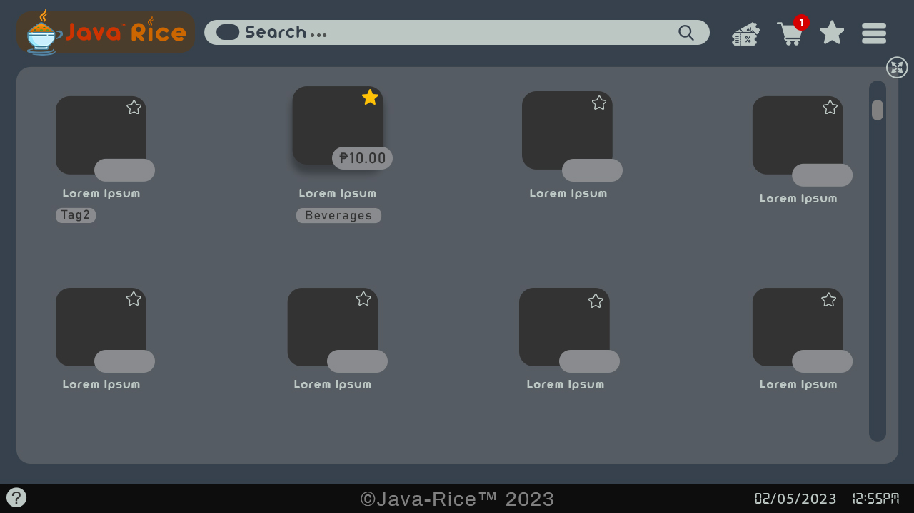
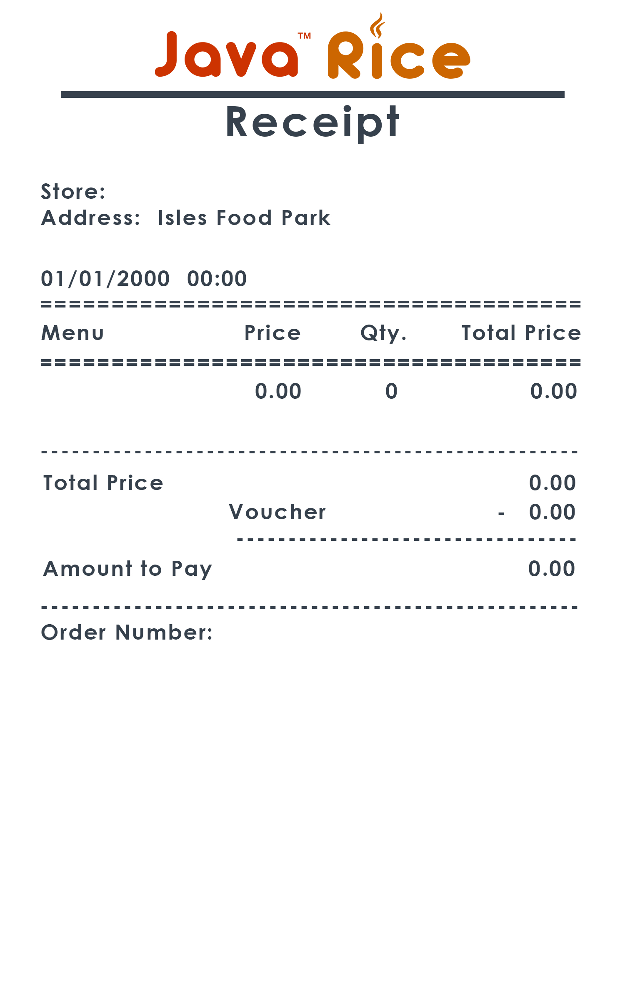
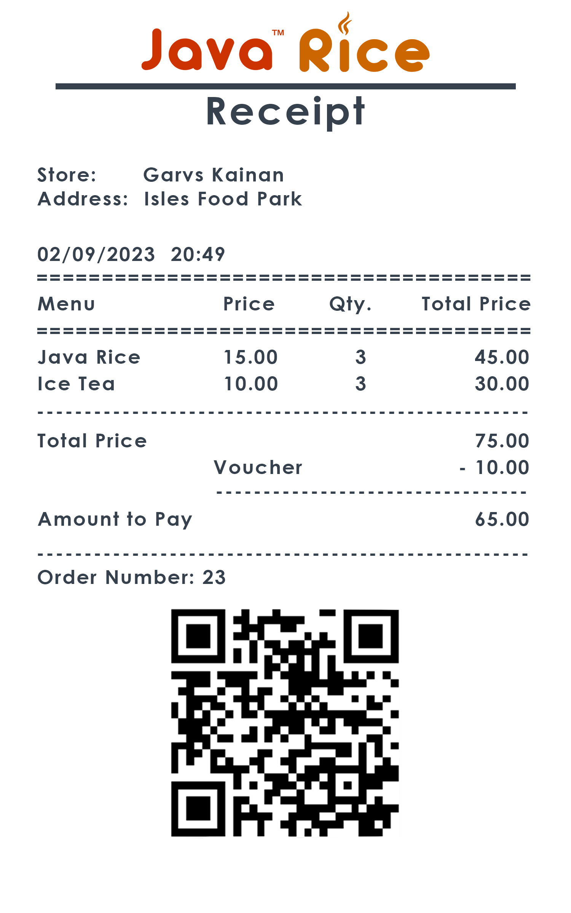
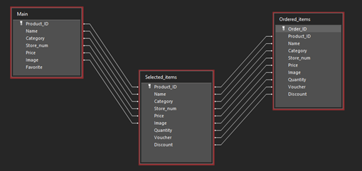

<p align="center">
<a href="https://pp-namias.github.io/Java-GUI/" target="blank"></a>
<a href="https://github.com/PP-Namias/Java-GUI/blob/master/LICENSE" target="blank"></a>
<a href="https://github.com/PP-Namias/Java-GUI/fork" target="blank"></a>
<a href="https://github.com/PP-Namias/Java-GUI/stargazers" target="blank"></a>
<a href="https://github.com/PP-Namias/Java-GUI/issues" target="blank"></a>
<a href="https://github.com/PP-Namias/Java-GUI/pulls" target="blank"></a>
</p>
<br>

# __Title: Java Rice__ - An Interactive Food Ordering System
## __Introduction__
Java Rice is a food ordering system designed to make the process of ordering food easier for users. The system is built using Java and Maven GUI, which provides an interactive and user-friendly experience. The purpose of this system is to allow users to order their favorite meals with ease and convenience.

## __Objectives__
  * To provide a platform where users can order food with just a few clicks.
  *	To make the process of food ordering fast and efficient.
  *	To provide users with an interactive and user-friendly experience.
  *	To provide a secure and reliable platform for food ordering.

## __Methodology__
*	The system will be built using Java programming language and Maven GUI for the front-end interface.
*	A database will be used to store all the information about the food items and orders.
*	The system will provide a user-friendly interface for users to place their orders.
*	The system will use secure payment methods to process the transactions.

## __Timeline__
- [x] Planning and Design Phase: 2 weeks
- [ ] Development Phase: 4 weeks
- [ ] Testing and Debugging Phase: 2 weeks
- [ ] Deployment Phase: 1 week

## __Limitations__
*	The system will only be available for use on devices with Java and Maven GUI installed.
*	The system will only support online payment methods.
*	The system will not provide delivery services.

## __Criteria__
*	Usability
*	Availability
*	Reliability
*	Maintainability
*	Security

## __Conclusion__
Java Rice is a food ordering system designed to provide users with a fast and convenient way to order food. The system is built using Java and Maven GUI, which provides an interactive and user-friendly experience. The system will provide a secure platform for food ordering and will be accessible on devices with Java and Maven GUI installed. The estimated timeline is 9 weeks.

## __References__
*	Java Programming Language Reference: Oracle Corporation
*	Maven GUI Reference: Apache Software Foundation

## __Appendix__
*	Detailed project plan
*	Technical specifications
*	UI Design

## __UI Design__
<br>
<p align="center">
  
  <br>
  <b>Java Rice Logo [Transparent]</b>
  <br>
  <br>  
  
  <br>
  <b>Java Rice Banner with Logo [Transparent]</b>
  <br>
  <br>
  
  <br>
  <b>Java Rice Banner [Transparent]</b>
  <br>
  <br>
  
  <br>
  <b>Java Rice Main Form [Regular]</b>
  <br>
  <br>
  
  <br>
  <b>Java Rice Main Form [Maximize]</b>
  <br>
  <br>
  
  <br>
  <b>Java Rice Receipt [Default]</b>
  <br>
  <br>
  
  <br>
  <b>Java Rice Receipt [Example]</b>
  <br>
  <br>
</p>


  <br>

## __Database__
```sql
CREATE TABLE IF NOT EXISTS Products (
	Product_ID SERIAL NOT NULL PRIMARY KEY,
	Name TEXT NOT NULL,
	Category TEXT NOT NULL,
	Store_num TEXT NOT NULL,
	Price DOUBLE PRECISION NOT NULL,
	Image OBJ NOT NULL,
	Favorite BOOL NOT NULL
);
CREATE TABLE IF NOT EXISTS Cart (
	Product_ID SERIAL NOT NULL PRIMARY KEY,
	Name TEXT NOT NULL,
	Category TEXT NOT NULL,
	Store_num TEXT NOT NULL,
	Price DOUBLE PRECISION NOT NULL,
	Image OBJ NOT NULL,
	Quantity INT NOT NULL,
	Voucher TEXT NOT NULL,
	Discount DOUBLE NOT NULL
);
CREATE TABLE IF NOT EXISTS Order (
	Order_ID SERIAL NOT NULL PRIMARY KEY,
	Product_ID SERIAL NOT NULL,
	Name TEXT NOT NULL,
	Category TEXT NOT NULL,
	Store_num TEXT NOT NULL,
	Price DOUBLE PRECISION NOT NULL,
	Image OBJ NOT NULL,
	Quantity INT NOT NULL,
	Voucher TEXT NOT NULL,
	Discount DOUBLE NOT NULL
);
CREATE TABLE IF NOT EXISTS Sales (
	Order_ID SERIAL NOT NULL PRIMARY KEY,
	Product_ID SERIAL NOT NULL,
	Category TEXT NOT NULL,
	Store_num TEXT NOT NULL,
	Quantity INT NOT NULL,
	Date_processed DATE NOT NULL,
	Profit DOUBLE NOT NULL
);
```
<p align="center">
  
  <br>
  <b>Java Rice Database [Relationship]</b>
  <br>
</p>

## __Forms__
- MainForm
- Cashier
- Receipt

## __Functions__
- Ordering system [multiple selections]
- Auto-generated search bar
- Receipt 
- Order logs
- Items order
- Order number
- QR Code [generator] [reader]
- Voucher Discounts

## __Color Palette__
- Main Background: #36414d
- Foreground: #898b8e
- Text (Dark): #36414d // Light Background
- Text (Light): #bcc7c4 // Dark Background
- Other:
  - #333333
  - #5182a1
- Cart: #808080
  - #63656a
- Footer: #0d0d0d
- Logo:
  - #cc3300 // Java
  - #cc6600 // Rice
